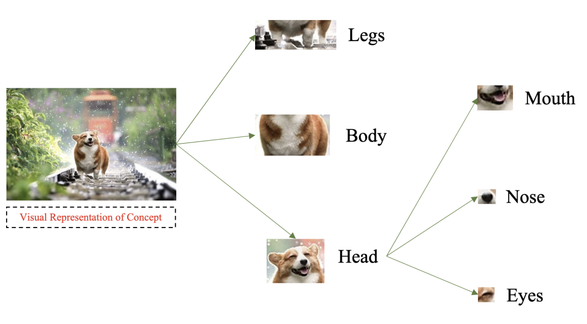
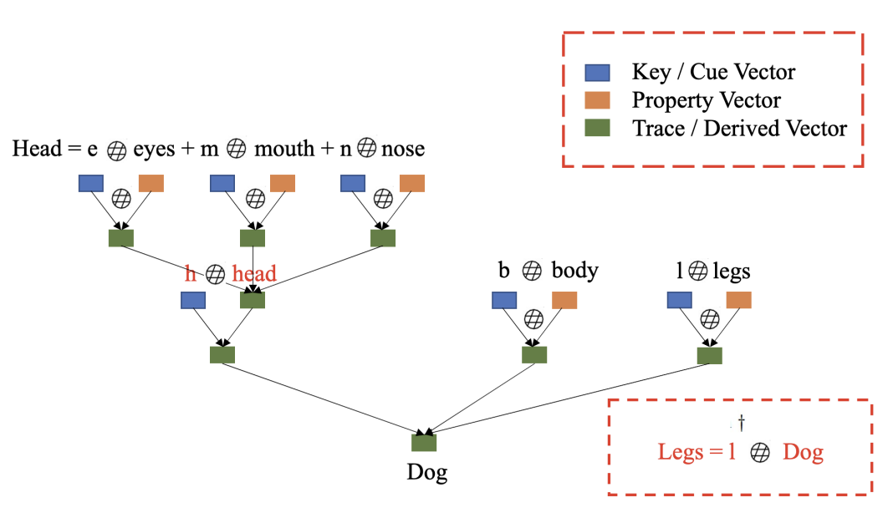

Learning with Holographic Reduced Representations
-------------------------------------------------

Holographic Reduced Representations (HRR) are a form vector representation that can be decomposed into their constituent factors, while keeping the size of the vector representation constant. This repository contains the implementation of the paper [Learning with Holographic Reduced Representations (HRR)](https://arxiv.org/pdf/2109.02157.pdf) published @ [NeurIPS 2021](https://nips.cc/Conferences/2021/).

Basics Of Holographic Reduced Representations
---------------------------------------------
Following is an example of how HRR can be utilized. The example consists a ```dog``` represented as a composition of its various body parts where each attribute can be represented with its own vector representation. HRR allows us to create a single representation of the concept of a ```dog```, making it possible to query the representation to answer questions such as ```Does the dog have legs?```.

Example of a Concept Hierarchy             |  HRR Representation of Concept Hierarchy
:-------------------------:|:-------------------------:
   |  

HRR Operations
--------------
### Binding.
```python
def binding(x, y):
    return torch.real(ifft(torch.multiply(fft(x), fft(y))))
```

### Unbinding.
```python
def approx_transpose(x):
    x = torch.flip(x, dims=[-1])
    return torch.roll(x, 1, dims=-1)

unbind = lambda x, y: binding(s, approx_transpose(y))
```

### Normalization in FFT Space.
```python
def projection(x):
    f = torch.abs(fft(x)) + 1e-5
    p = torch.real(ifft(fft(x) / f))
    return torch.nan_to_num(p) #defensive 
```

Code Details
------------
This repository contains the implementation of Holographic Reduced Representations (HRR) for eXtreme Multi-Label classification (XML). We implement / use different network architectures in order to showcase how HRRs can used to train and performance inference while reducing the size of the output layer of the network.

We experiment with ```3``` different architectures:
1. A standard 2-layer feedforward network (FFN).
2. [XML-CNN](https://dl.acm.org/doi/pdf/10.1145/3077136.3080834): A convolutional neural network architecture.
3. [Attention-XML](https://arxiv.org/pdf/1811.01727.pdf): A convolutional neural network architecture with attention.

### Layout
    ├── attention-xml/          # HRR implementation with AttentionXML.
    ├── data/<dataset name>     # Location where dataset is stored. Example: data/Bibtex
    ├── analysis/               # Ipython notebooks with analysis of randomly generated label vectors.
    ├── lib/                    # Library functions and implementation of HRR.
    ├── xml-cnn/                # HRR implementation with XML-CNN.
    ├── LICENSE
    └── README.md

Consider the example dataset: ```Wiki10-31K```
#### Model Training
For training the model with HRR:
```bash
python run_classifier.py --data-file None --tr-split data/Wiki10/train.txt --te-split data/Wiki10/test.txt \
--save data/model+results/Wiki10/ --name neurips-2021-results/ --batch-size 64 \
--test-batch-size 64 --th 0.3 --debug
```

For training the baseline model:
```bash
python run_classifier.py --data-file None --tr-split data/Wiki10/train.txt --te-split data/Wiki10/test.txt \
--save data/model+results/Wiki10/ --name neurips-2021-results/ --batch-size 64 \
--test-batch-size 64 --th 0.3 --debug --baseline
```

### Additional Parameters
The default run_classifier.py both updates the p & n vectors and has a loss with negative labels (i.e. labels not present for a given sample text). In order to train the model without gradient update to p & n vectors, add the ```--no-grad``` option. To train the model with positive labels only, add the ```--without-negative``` option to the above command. The default dimension size is ```400```. Change the label dimension size with ```--spn-dim```.

To compare the HRR-FFN (FFN trained with HRR) against a standard multi-label FFN, the ```--baseline``` option can used.

## Replicating Experiments
Following are the commands to replicate experiments (example ```Bibtex``` dataset) using a feedforward network:

#### Main Experiments (for dimension size 750)

1. Training HRR-based model with label gradient and negation.
```bash
python run_classifier.py --data-file None --tr-split data/Wiki10/train.txt --te-split data/Wiki10/test.txt \
--save data/model+results/Wiki10/ --name neurips-2021-results/ --batch-size 64 \
--test-batch-size 64 --th 0.3 --debug --spn-dim 750
```

2. Training HRR-based model with label gradient and WITHOUT negation.
```bash
python run_classifier.py --data-file None --tr-split data/Wiki10/train.txt --te-split data/Wiki10/test.txt \
--save data/model+results/Wiki10/ --name neurips-2021-results/ --batch-size 64 \
--test-batch-size 64 --th 0.3 --debug --spn-dim 750 --without-negative
```

3. Training HRR-based model WITHOUT label gradient and WITHOUT negation.
```bash
python run_classifier.py --data-file None --tr-split data/Wiki10/train.txt --te-split data/Wiki10/test.txt \
--save data/model+results/Wiki10/ --name neurips-2021-results/ --batch-size 64 \
--test-batch-size 64 --th 0.3 --debug --spn-dim 750 --without-negative --no-grad
```

### Running with SLURM.
To train the model using [SLURM](https://slurm.schedmd.com/documentation.html) (i.e., in case there is a cluster available), use scripts ```experiments.sh``` (the slurm script is ```train.slurm.sh```).

```bash
./experiments.sh Bibtex grad-and-neg all 400 0.3 grad with-negative
./experiments.sh Bibtex grad-and-no-neg all 400 0.3 grad without-negative
```

For all combinations of training:
```bash
./experiments.sh Bibtex no-grad-and-no-neg all 400 0.3 no-grad without-negative
./experiments.sh Bibtex grad-and-no-neg all 400 0.3 grad without-negative
./experiments.sh Bibtex no-grad-and-neg all 400 0.3 no-grad with-negative
./experiments.sh Bibtex grad-and-neg all 400 0.3 grad with-negative
```

#### Measuring impact of gradient and dim size.
```bash
./experiments.sh Bibtex <dim_size>-grad-and-neg all <dim size> 0.3 grad with-negative
./experiments.sh Bibtex <dim_size>-no-grad-and-neg all <dim size> 0.3 no-grad with-negative
```

### Command Line Arguments
```bash
usage: run_classifier.py [-h] [--name NAME] [--batch-size N] [--test-batch-size N] [--epochs N] [--lr LR] [--th TH] [--gamma M] [--no-cuda] [--seed S] [--topk S] [-a A] [-b B]
                         [--log-interval N] [--save SAVE] [--data-file DATA_FILE] [--tr-split TR_SPLIT] [--te-split TE_SPLIT] [--test] [--reduce-dims] [--debug] [--baseline]
                         [--spn-dim S] [--no-grad] [--without-negative] [--load-vec LOAD_VEC]

Extreme Multi-label Classification.

optional arguments:
  -h, --help            show this help message and exit
  --name NAME           A unique experiment name.
  --batch-size N        input batch size for training (default: 64)
  --test-batch-size N   input batch size for testing (default: 250)
  --epochs N            number of epochs to train (default: 100)
  --lr LR               learning rate (default: 1.0)
  --th TH               Theshold for label inference.
  --gamma M             Learning rate step gamma (default: 0.7)
  --no-cuda             disables CUDA training
  --seed S              random seed (default: 100)
  --topk S              Retreive top k labels (Default: 5).
  -a A                  Inverse propensity value A (Default: 0.55).
  -b B                  Inverse propensity value A (Default: 1.5).
  --log-interval N      how many batches to wait before logging training status
  --save SAVE           Directory to save model and results.
  --data-file DATA_FILE
                        Location of the data CSV file.
  --tr-split TR_SPLIT   Get the training split for dataset.
  --te-split TE_SPLIT   Get the test split for dataset.
  --test                Perform tests on pretrained model.
  --reduce-dims         Reduce dimensions of the features.
  --debug               Print debug statements for verification.
  --baseline            Use Baseline Network.
  --spn-dim S           Label vector dimensions (Default: 400)
  --no-grad             Update Label vectors.
  --without-negative    disable negative loss.
  --load-vec LOAD_VEC   Location of pretrained vectors.
```

References
----------
1. [Learning with Holographic Reduced Representations (HRR) @ NeurIPS 2021](https://arxiv.org/pdf/2109.02157.pdf)

Bibtex:
```
@inproceedings{ganesan2021learning,
author = {Ganesan, Ashwinkumar and Gao, Hang and Gandhi, Sunil and Raff, Edward and Oates, Tim and Holt, James and McLean, Mark},
booktitle = {Advances in Neural Information Processing Systems},
eprint = {2109.02157},
title = {{Learning with Holographic Reduced Representations}},
url = {http://arxiv.org/abs/2109.02157},
year = {2021}
}
```
---
